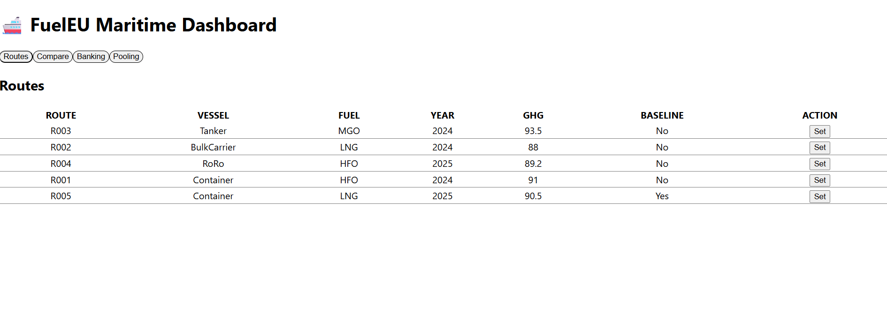
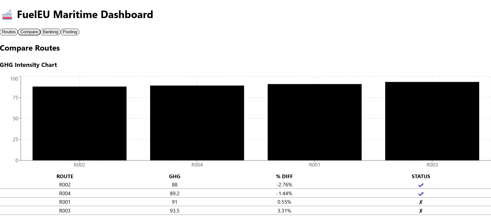
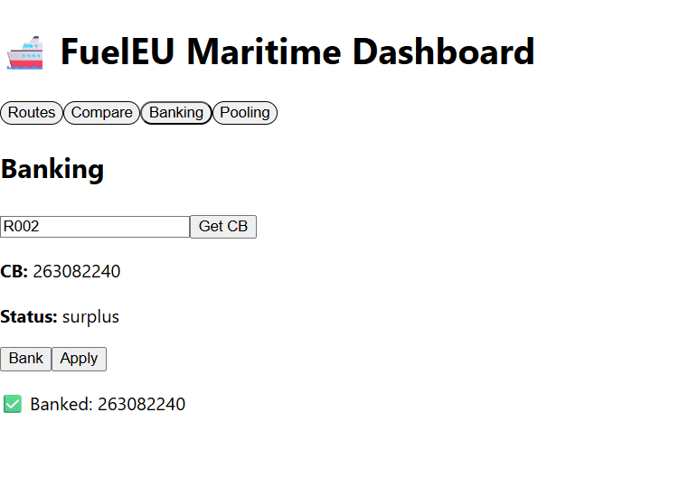
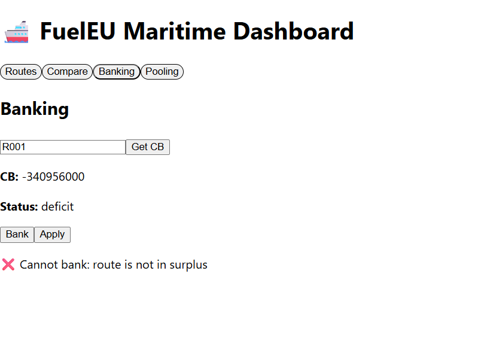
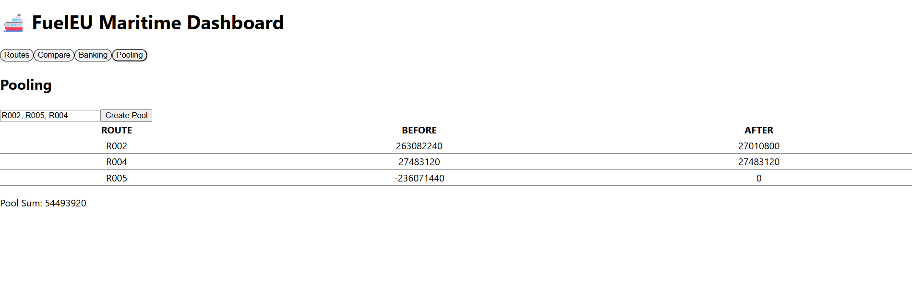

# FuelEU Maritime Compliance Platform

A full-stack application implementing core parts of the **FuelEU Maritime Regulation (EU 2023/1805)**.

---

## Overview

This system allows:

- Tracking GHG emissions
- Comparing routes against regulatory targets
- Calculating Compliance Balance (CB)
- Banking surplus emissions
- Pooling compliance across ships

---

## Architecture

This project follows **Hexagonal Architecture (Ports & Adapters)**.

### Backend

```
core → ports → adapters → infrastructure
```

### Frontend

```
UI → Use Cases → API Adapters
```

---

## Tech Stack

### Backend

- Node.js
- TypeScript
- Express
- PostgreSQL

### Frontend

- React
- TypeScript
- TailwindCSS
- Recharts (for visualization)

---

## Setup Instructions

### Backend

```bash
cd backend
npm install
npm run dev
npm test
```

---

### Frontend

```bash
cd frontend
npm install
npm run dev
```

---

## API Endpoints

### Routes

- GET `/routes`
- POST `/routes/:id/baseline`
- GET `/routes/comparison`

### Compliance

- GET `/compliance/cb?routeId=R001`

### Banking

- POST `/banking/bank`
- POST `/banking/apply`

### Pooling

- POST `/pools`

---

## Core Concepts

### Compliance Balance (CB)

```
CB = (Target − Actual) × Energy
Energy = fuelConsumption × 41000
```

---

## Screenshots

### Routes



### Compare (with Chart)



### Banking




### Pooling



---

## Testing

- Unit tests → CB calculation
- Integration tests → API endpoints

Run:

```bash
npm test
```

---

## AI Usage

AI tools were used for:

- Code scaffolding
- Debugging
- Algorithm design
- Refactoring

See `AGENT_WORKFLOW.md` for details

---

## Future Improvements

- Add authentication
- Persist pooling data
- Improve UI/UX
- Add more visual analytics

---
